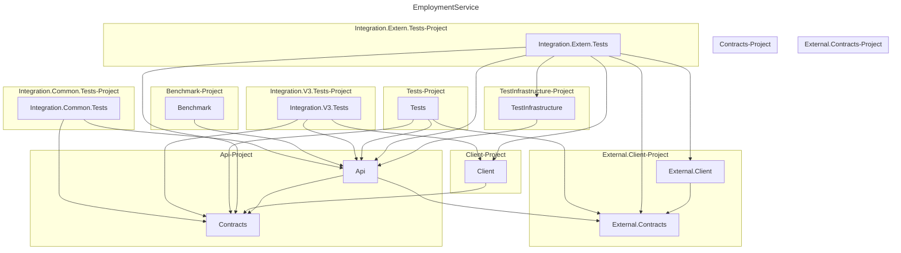

```mermaid
---
title: "EmploymentService"
---
graph TB
    subgraph External.Contracts-Project
    end
    subgraph External.Client-Project
        External.Client-->External.Contracts
    end
    subgraph Contracts-Project
    end
    subgraph Api-Project
        Api-->Contracts
        Api-->External.Contracts
    end
    subgraph Client-Project
        Client-->Contracts
    end
    subgraph TestInfrastructure-Project
        TestInfrastructure-->Api
    end
    subgraph Integration.Extern.Tests-Project
        Integration.Extern.Tests-->Api
        Integration.Extern.Tests-->Client
        Integration.Extern.Tests-->Contracts
        Integration.Extern.Tests-->External.Client
        Integration.Extern.Tests-->External.Contracts
        Integration.Extern.Tests-->TestInfrastructure
    end
    subgraph Tests-Project
        Tests-->Api
        Tests-->Contracts
        Tests-->External.Contracts
    end
    subgraph Integration.V3.Tests-Project
        Integration.V3.Tests-->Api
        Integration.V3.Tests-->Client
        Integration.V3.Tests-->Contracts
    end
    subgraph Benchmark-Project
        Benchmark-->Api
    end
    subgraph Integration.Common.Tests-Project
        Integration.Common.Tests-->Api
        Integration.Common.Tests-->Contracts
    end
```
